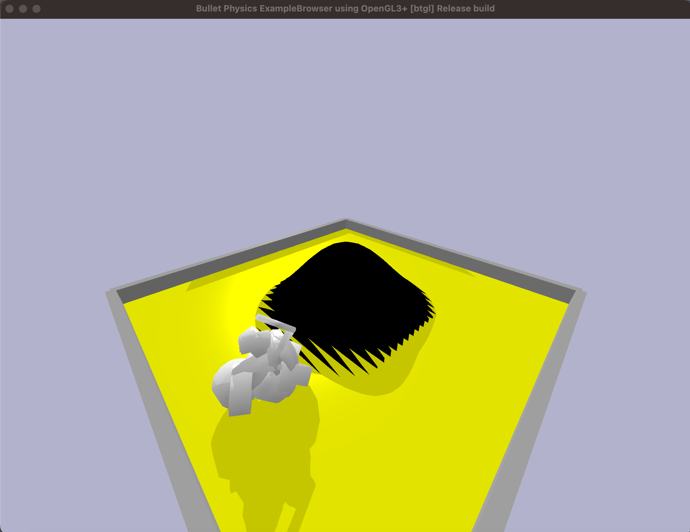
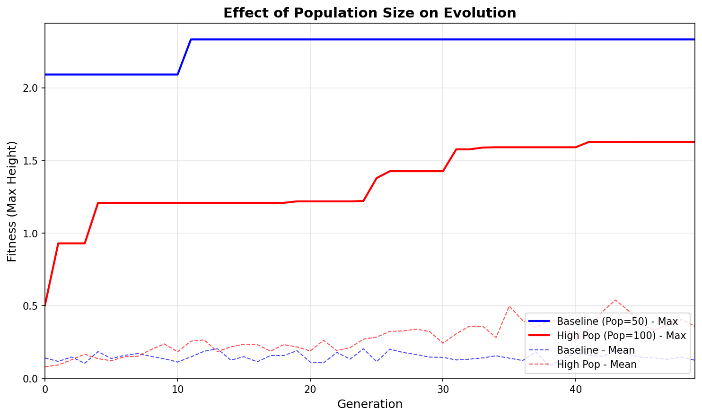
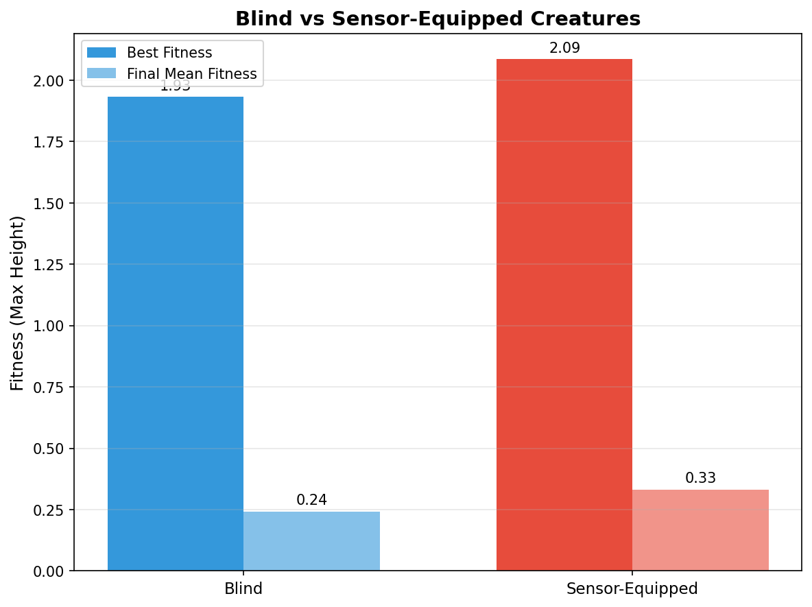

# Evolving Mountain-Climbing Creatures

A genetic-algorithm system that evolves virtual creatures to **climb a procedurally generated mountain** inside the PyBullet physics simulator. Starting from random bodies and motor patterns, populations evolve over generations into creatures that can purposefully climb and hold their position — without any hand-designed locomotion.

> University of London CM3020 *Artificial Intelligence* final coursework. Python · PyBullet · NumPy.



## Highlights

- **Reward-hacking-resistant fitness function.** A naive "distance travelled" metric let creatures exploit physics glitches to fling themselves into the air. I designed a stability-based fitness using the *minimum* height over the final second of simulation, so only creatures that climb **and stay stable** score well.
- **Sensory feedback.** Creatures sense the direction to the peak via the dot product between their heading and the vector to the summit (a normalised −1…+1 signal), which modulates motor output — enabling reactive steering rather than blind oscillation.
- **Robust parallel evaluation.** Fitness evaluations run across processes with per-creature timeouts (`ProcessPoolExecutor`), so a single deadlocked physics simulation can't freeze multi-hour evolutionary runs.
- **Procedural landscapes.** Terrain is generated from a Gaussian function, so difficulty (steepness, size) can be varied systematically to test generalisation rather than overfitting to one map.
- **Encoding experiments.** Custom genome variants (constrained "snake" morphology, control-only evolution) isolate how body plan vs. motor control affect climbing performance.

## Experiments & results

GA parameter tuning and encoding experiments, each measured over 50 generations:

| Experiment | Finding |
|------------|---------|
| Population size (50 vs 100) | Smaller population reached higher peak fitness; larger preserved more diversity |
| Mutation rate (0.1 vs 0.2) | Higher mutation gave the best creature overall, at the cost of stability |
| Standard vs snake morphology | Wide-based bodies strongly outperformed linear ones for climbing |
| Blind vs sensor-equipped | Sensory feedback improved both peak and average fitness |




(See [`results/`](results) for the full set of comparison graphs and creature screenshots.)

## Tech stack

- **Python** — genetic algorithm, genome encoding, experiment harness
- **PyBullet** — physics simulation and creature embodiment (URDF)
- **NumPy** — vector maths and fitness computation
- **Matplotlib / pandas** — experiment analysis and graphs

## Project layout

| File | Purpose |
|------|---------|
| `mountain_simulation.py` | Core simulation, fitness function, parallel evaluation |
| `creature.py` / `genome.py` | Creature embodiment and genetic encoding |
| `genome_experiments.py` | Encoding variants (snake morphology, control-only) |
| `generate_landscapes.py` | Procedural Gaussian terrain generation |
| `population.py` | Population, selection and reproduction |
| `master_evolution.py` / `run_experiments.py` | Experiment entry points |
| `playback.py` | Replay and visualise an evolved creature |
| `shapes/` | Mountain meshes (`.obj` / `.urdf`) |

## Running it

```bash
pip install -r requirements.txt

# Run an evolutionary experiment
python run_experiments.py

# Replay/visualise an evolved creature
python playback.py
```

A PyBullet GUI window opens to visualise the simulation. Evolution runs are CPU-intensive and can take a while; runs parallelise across cores automatically.

## Notes

Generated artefacts (thousands of temporary URDF files, raw per-run CSVs, and the demo video) are excluded from the repo — the result graphs in `results/` summarise the experiment data, which can be regenerated from the scripts.
